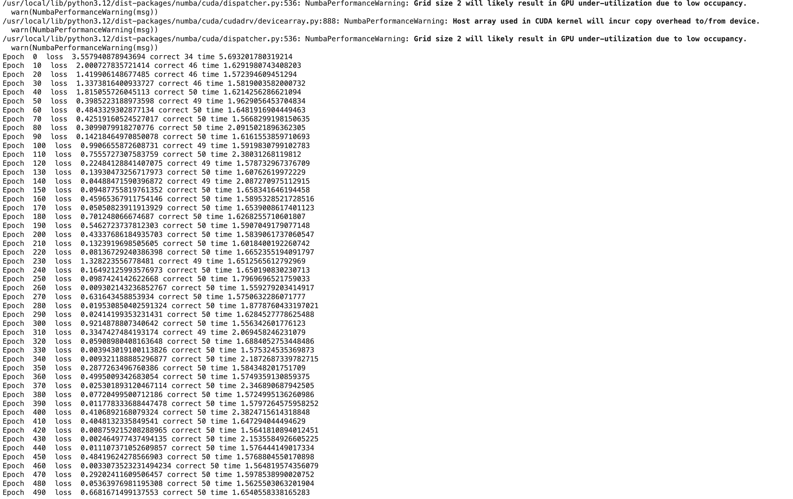
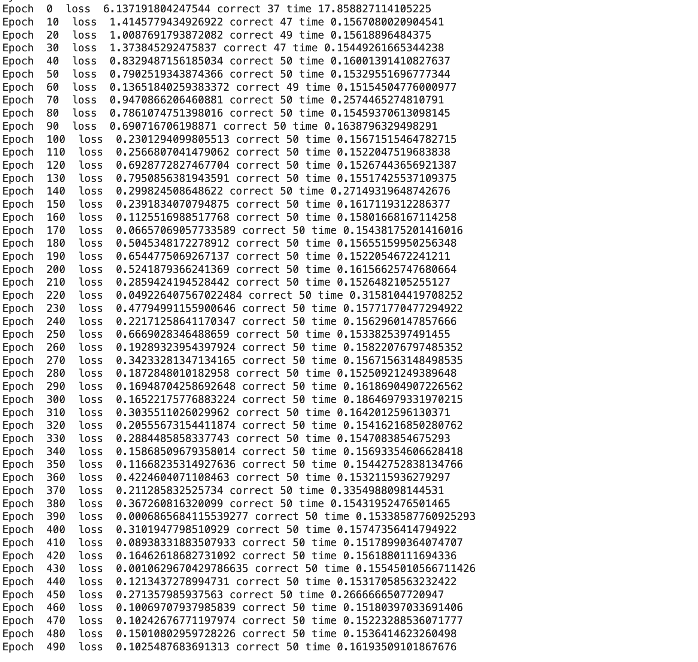
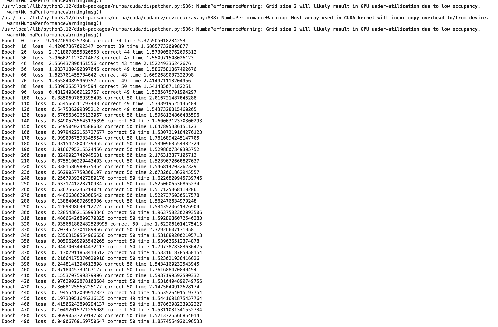
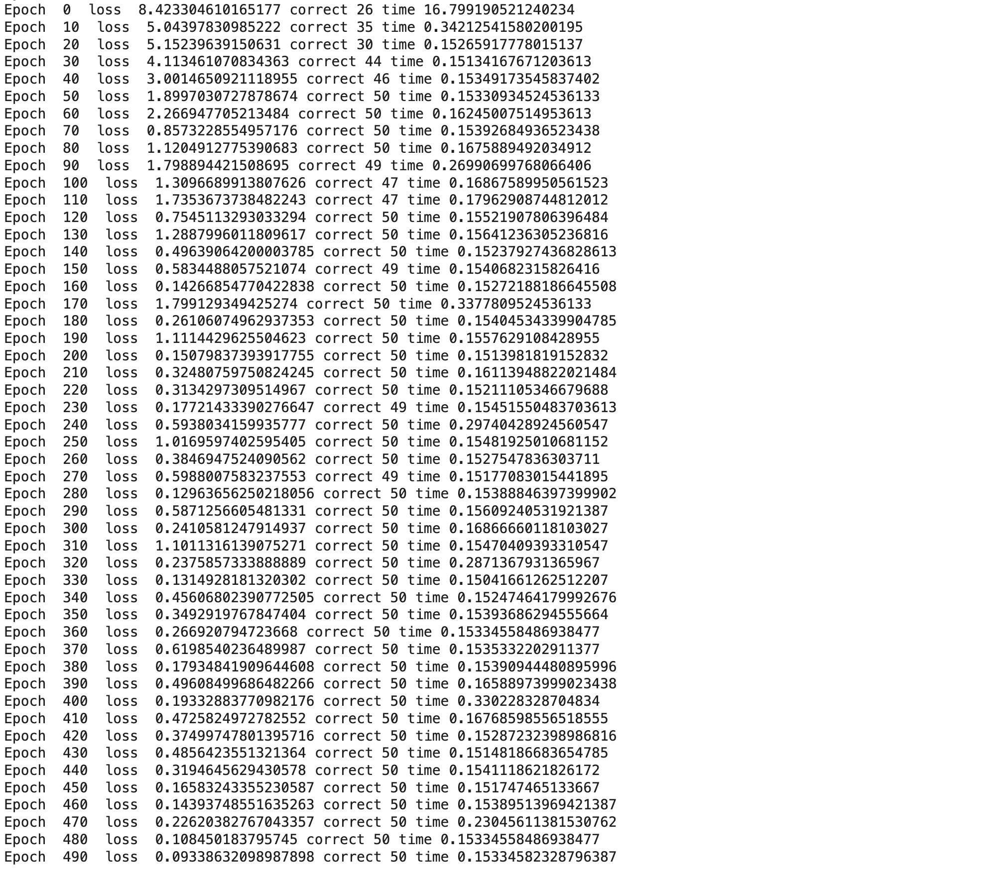
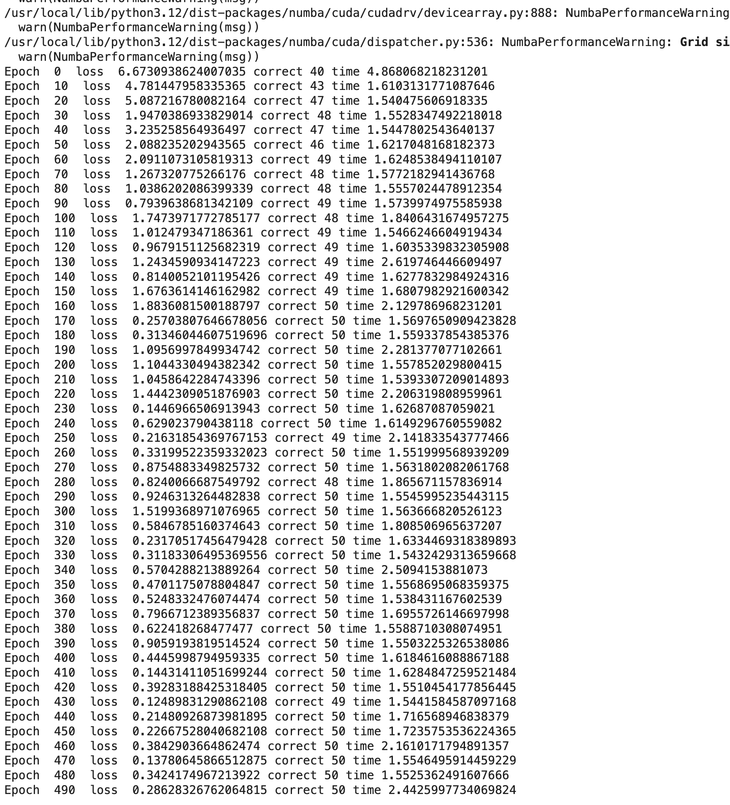
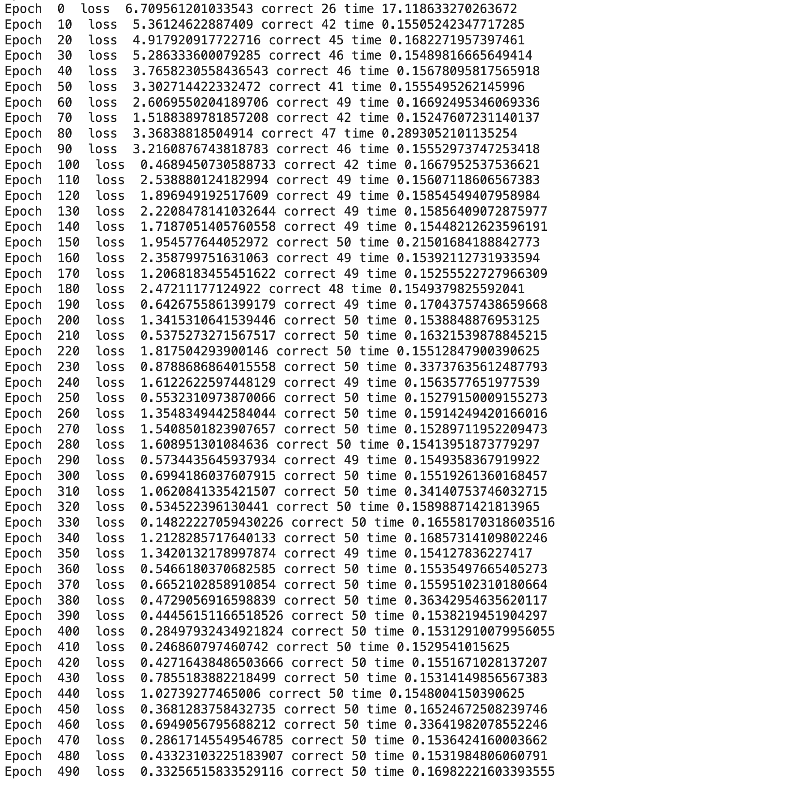
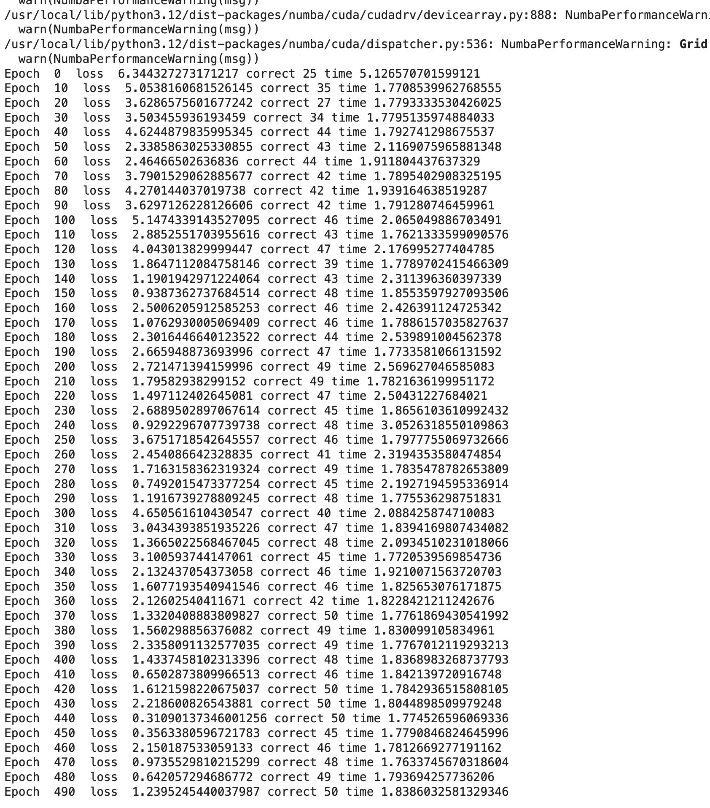
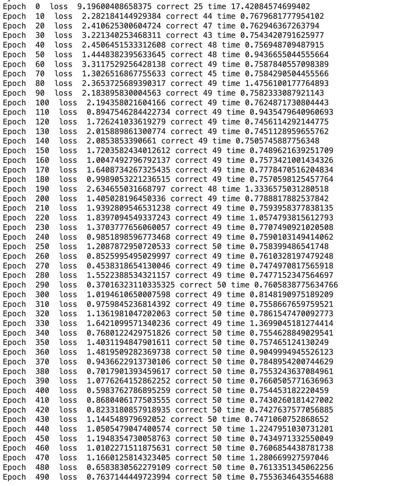

# MiniTorch Module 3


* Docs: https://minitorch.github.io/

* Overview: https://minitorch.github.io/module3.html


You will need to modify `tensor_functions.py` slightly in this assignment.

* Tests:

```
python run_tests.py
```

* Note:

Several of the tests for this assignment will only run if you are on a GPU machine and will not
run on github's test infrastructure. Please follow the instructions to setup up a colab machine
to run these tests.

This assignment requires the following files from the previous assignments. You can get these by running

```bash
python sync_previous_module.py previous-module-dir current-module-dir
```

The files that will be synced are:

        minitorch/tensor_data.py minitorch/tensor_functions.py minitorch/tensor_ops.py minitorch/operators.py minitorch/scalar.py minitorch/scalar_functions.py minitorch/module.py minitorch/autodiff.py minitorch/module.py project/run_manual.py project/run_scalar.py project/run_tensor.py minitorch/operators.py minitorch/module.py minitorch/autodiff.py minitorch/tensor.py minitorch/datasets.py minitorch/testing.py minitorch/optim.py


## Task3_5 Results

### Simple

```bash
!cd $DIR; time PYTHONPATH=/content/$DIR python3.12 project/run_fast_tensor.py --BACKEND gpu --HIDDEN 100 --DATASET split --RATE 0.05 --PLOT True
!cd $DIR; time PYTHONPATH=/content/$DIR python3.12 project/run_fast_tensor.py --BACKEND cpu --HIDDEN 100 --DATASET split --RATE 0.05 --PLOT True
```




### Split

```bash
!cd $DIR; time PYTHONPATH=/content/$DIR python3.12 project/run_fast_tensor.py --BACKEND gpu --HIDDEN 100 --DATASET split --RATE 0.05 --PLOT True
!cd $DIR; time PYTHONPATH=/content/$DIR python3.12 project/run_fast_tensor.py --BACKEND cpu --HIDDEN 100 --DATASET split --RATE 0.05 --PLOT True
```

split

output





### xor


Script
```bash
!cd $DIR; time PYTHONPATH=/content/$DIR python3.12 project/run_fast_tensor.py --BACKEND gpu --HIDDEN 100 --DATASET xor --RATE 0.05 --PLOT True
!cd $DIR; time PYTHONPATH=/content/$DIR python3.12 project/run_fast_tensor.py --BACKEND cpu --HIDDEN 100 --DATASET xor --RATE 0.05 --PLOT True
```

output




### Bigger Example xor

```bash
!cd $DIR; time PYTHONPATH=/content/$DIR python3.12 project/run_fast_tensor.py --BACKEND gpu --HIDDEN 300 --DATASET xor --RATE 0.01
!cd $DIR; time PYTHONPATH=/content/$DIR python3.12 project/run_fast_tensor.py --BACKEND cpu --HIDDEN 300 --DATASET xor --RATE 0.01
```


